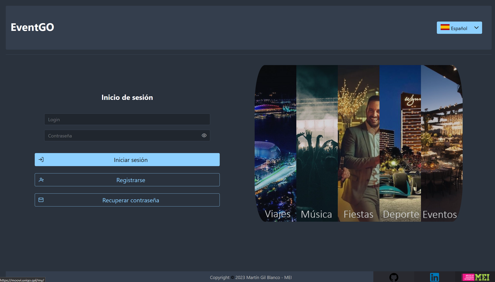
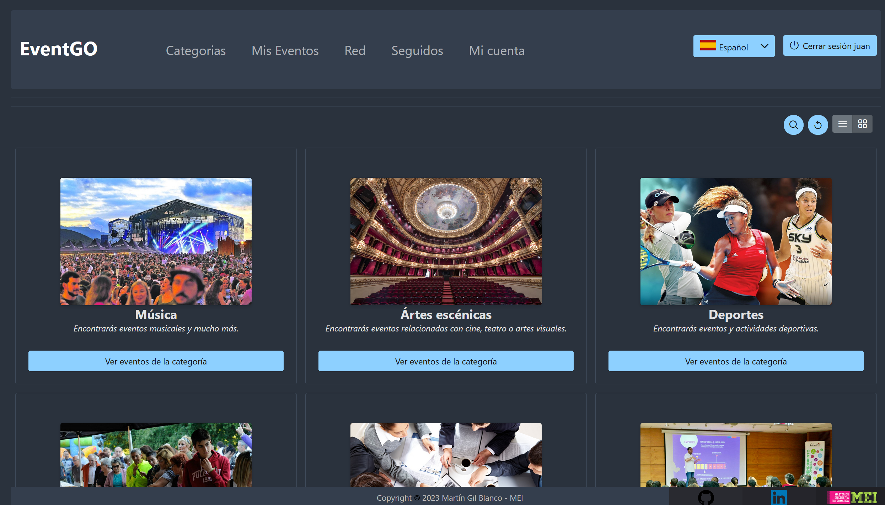
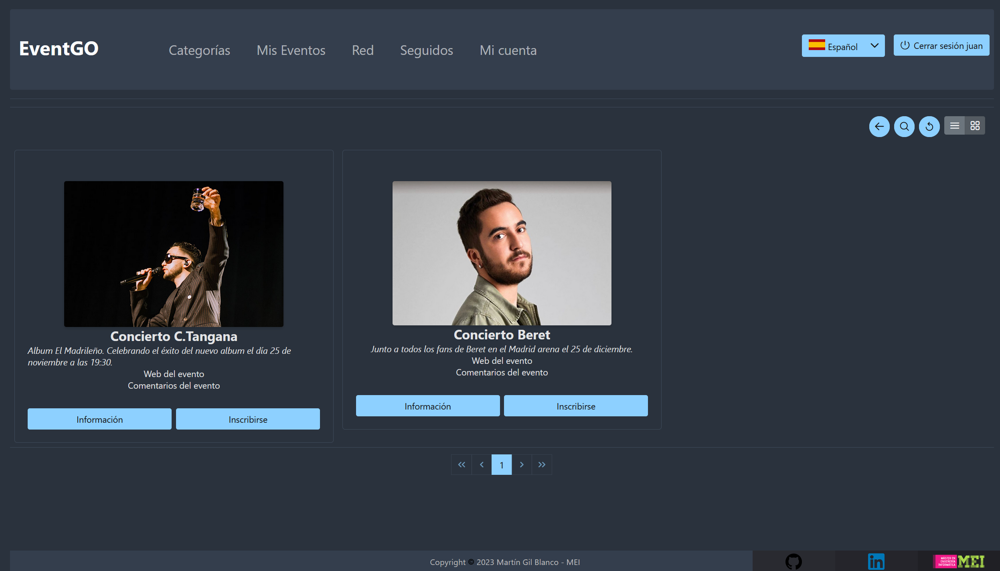
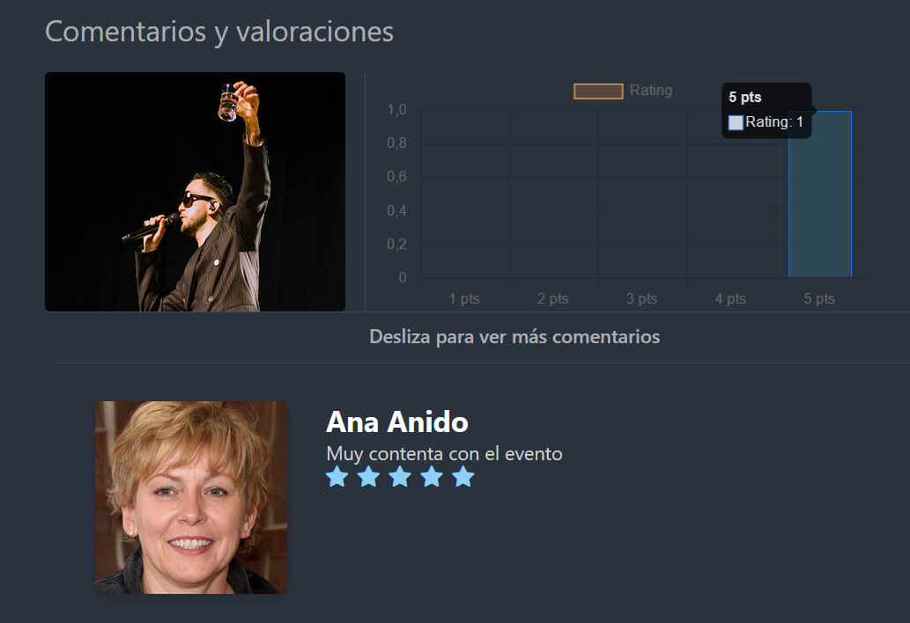
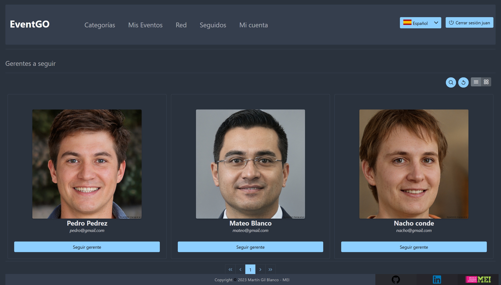

# EventGO-react

## TFM Máster en Ingeniería Informática

### Plataforma de Gestión de Eventos con React

Para implementar la plataforma de asistencia a la gestión de eventos se plantea el desarrollo de una aplicación web con dos elementos principales: un back-end responsable del almacenamiento de los datos y de la implementación de la lógica de la aplicación desarrollado en Java, haciendo uso de las funcionalidades de Spring Framework y un front-end de tipo Single page application o SPA empleando la librería de JavaScript React.

A continuación se muestran el proceso necesario para iniciar el front-end de la aplicación.

A mayores, se adjunta en la ruta /documentacion la memoria del proyecto y un archivo JSON TFM.postman.json con las peticiones HTTP del back-end. Además, en el repositorio EventGo podrá encontrar el Api Rest del back-end con el proceso de puesta en marcha.

---

### Manual de instalación

Para su ejecución debemos instalar las dependencias del proyecto que hace uso de Node.js versión 16 mediante los siguientes comandos una vez situados en el directorio base de nuestro proyecto.

```
npm install
npm start
```

Si el proceso ha sido exitoso, la interfaz del proyecto estará disponible en la URL por defecto en el puerto 3000, esta URL es la siguiente: http://localhost:3000

---

## Imágenes del proyecto

### Vista de inicio de la plataforma

El usuario podrá acceder a la plataforma, registrarse, recuperar su contraseña por correo electrónico e incluso acceder a una vista previa de categorías y eventos. Si este desea inscribirse si deberá acceder a la aplicación con su cuenta.



### Categorías de eventos

Existen un conjunto de categorías donde se podrán agrupar los diferentes eventos de la plataforma. Esto hace que los usuarios puedan buscar más facilmente eventos de su interés en función de sus gustos.



### Eventos

Los usuarios podrán ver información sobre un evento o inscribirse en este si es de su agrado.



### Comentarios

Podrán ver y comentar su opinión sobre un evento para aportar más información a la comunidad de EventGO.



### Amistades

Podrán seguir a gerentes de eventos (responsables de gestionar los eventos existentes y crear nuevos eventos en la plataforma) para estar al día de novedades y recibir avisos por correo electrónico.



---

Trabajo realizado por: Martín Gil Blanco
